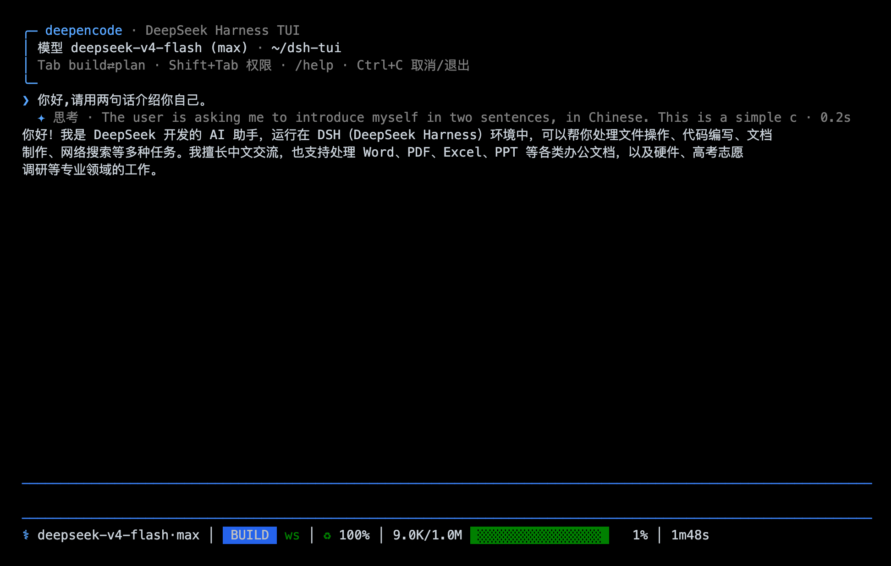
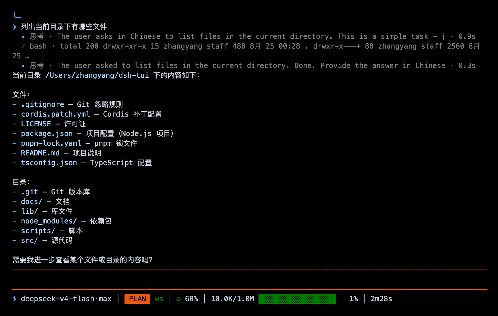
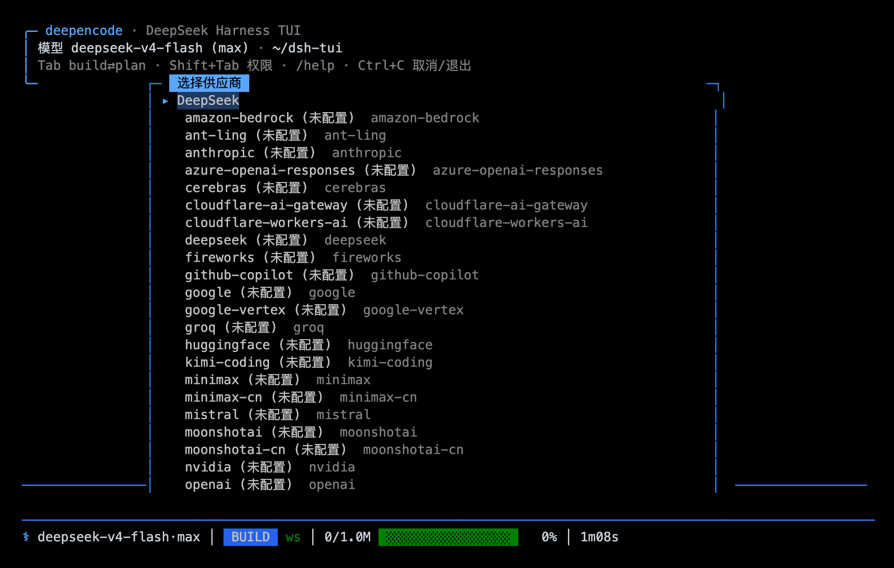

# deepencode

DeepSeek Harness 的TUI界面。UI围绕opencode风格，遵循极简原则。

```
⚕ deepseek-v4-pro·max │ BUILD ws │ ♻ 91% │ 9.4K/1.0M ░░░░░░░░░░░░░░░░ 1% │ 33s
```

## 截图







## 安装

仓库链:

```bash
git clone https://github.com/CheChc/deepencode.git
cd deepencode
pnpm install && pnpm build
dsh plugin --profile tui add link:$PWD
dsh --profile tui
```

恢复旧会话:

```bash
dsh --profile tui --resume <sessionId>
```

## 日常操作

斜杠命令:

```
/plan [off|文字]   进/出 plan 模式;带文字就进入后把文字当第一步
/model             换供应商、模型、思考强度
/effort            不换模型,只切思考强度
/provider add|rm   加/删第三方供应商,写 settings.yaml,热生效
/permissions       权限预设:read-only / workspace-write / danger-full-access
/sessions          已存会话列表
/status            模式、权限、模型、轮次
/help              全部命令
/quit              退出
```

按键:

```
Enter        发送
Shift+Enter  换行(Alt+Enter 也行)
Tab          输入框空着 → 切 build/plan;有字 → 文件路径补全
Shift+Tab    权限预设循环
Ctrl+C       跑着的时候取消本轮,闲着的时候退出
弹窗里        ↑/↓ 选,Enter 确认,Esc 取消
```

模式切换不刷日志。徽章和编辑器边框自己会变色,看一眼状态栏就知道现在是什么模式。

## 实现

一个 out-of-tree bundle,直接应用在 `dsh-base` 上,和官方 `dsh-headless` 同构:`tui-startup` 解析命令行,`tui-runner` 跑终端循环。渲染用 [pi-tui](https://www.npmjs.com/package/@earendil-works/pi-tui),差分重绘 + alternate screen。

核心要用的服务 dsh-base 有:会话流 `ctx.on('session/event')`,plan 模式 `ctx.planMode`,模型目录 `ctx.llm` + `installModelSelection` 热切换,统计读 `sessionProjections`(`tokenUsage` 算缓存命中率,`contextPressure` 算上下文水位),审批接 `approval/request` waterfall,问用户接 `userQuestions` provider。

兼容 dsh `0.1.1-rc.2`,Node ≥ 22，多终端通用，ui适配了中文。

## License

MIT
